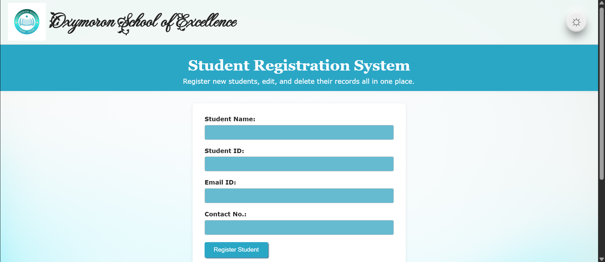
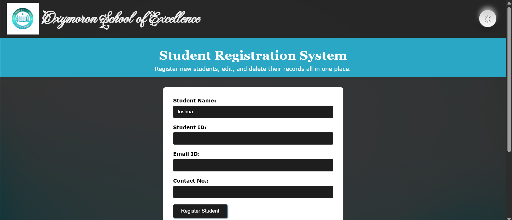
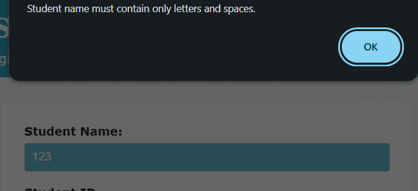
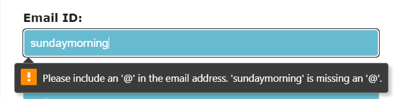
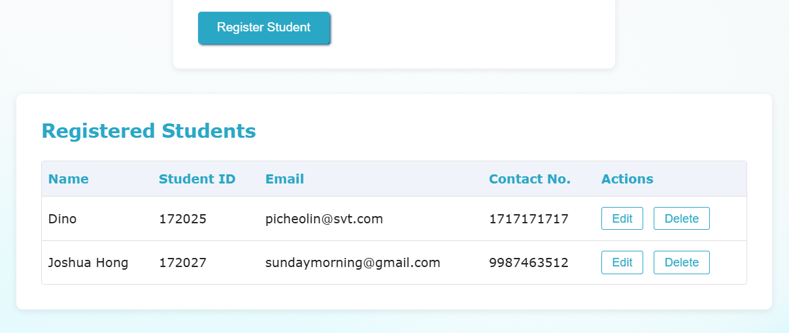

  

  <h1 style="display: inline-block; margin: 0;">
    🏫 Student Registration System
  </h1>

  A stylish and intuitive web-based Student Registration System that allows you to <strong>add</strong>, <strong>edit</strong>, <strong>view</strong>, and <strong>delete</strong> student records — all stored securely in your browser using <code>localStorage</code>. Built with love, creativity, and a sprinkle of animation ✨

## 🌟 Features

- 📋 **Add new students** with name, age, and grade
- 📝 **Edit or update** existing student details with ease
- ❌ **Delete** records instantly
- 🧠 **LocalStorage** based data persistence — no backend required!
- 🌗 **Dark Mode Toggle** — with sleek **Neumorphism UI**
- ⌨️ **Typing animation** for subheading text
- 🖋️ Custom Google Fonts for school branding
- 🖼️ Responsive and visually appealing UI
- 💻 Fully built with **HTML**, **CSS**, and **JavaScript**

## 🎨 Design Highlights

- **Neumorphism-styled dark mode toggle button** (inspired by [Uiverse](https://uiverse.io))
- **Typing animation** using JavaScript to bring the UI to life
- Embedded **Google Fonts** (`Fleur De Leah`) to style the school name with elegance
- Clean, responsive layout using modern CSS techniques

## 🏗️ Tech Stack

| Technology | Purpose                   |
|------------|----------------------------|
| HTML       | Structure & Semantics      |
| CSS        | Styling & Neumorphism UI   |
| JavaScript | Interactivity & Animation  |
| localStorage | Frontend Data Persistence |

## 📸 Screenshot

  <table>
    <tr>
      <td></td>
      <td></td>
    </tr>
    <tr>
      <td></td>
      <td></td>
      <td></td>
    </tr>
  </table>

## 🛠️ Setup Instructions
👉 **Check out the page for yourself here:** [Student Registration System Live Demo](https://nitya1950.github.io/Student_Registration_JS/)

